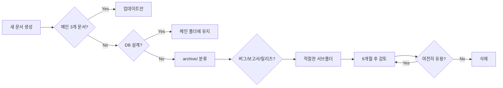

# 📚 Documentation Guidelines

**프로젝트**: HandLogger
**목적**: 문서 관리 규칙 및 가이드라인
**버전**: 1.0
**날짜**: 2025-10-05

---

## 🎯 핵심 원칙

### **3+1 문서 규칙**

**메인 문서 (3개만 유지)**:
1. **PRD** (Product Requirements Document) - 제품 요구사항
2. **LLD** (Low-Level Design) - 기술 설계
3. **PLAN** (Implementation Plan) - 구현 계획

**+1 기술 문서**:
4. **DB_DESIGN** - 데이터베이스 설계 (자주 참조되므로 메인 유지)

**나머지 모든 문서**: `docs/archive/` 하위 폴더로 이동

---

## 📂 문서 구조

```
docs/
├── README.md                    # 문서 인덱스 및 가이드
├── PRD_HandLogger.md           # 제품 요구사항 ✅ 메인
├── LLD_HandLogger.md           # 기술 설계 ✅ 메인
├── PLAN_HandLogger.md          # 구현 계획 ✅ 메인
├── DB_DESIGN_HandSheet.md      # DB 설계 ✅ 기술 문서
└── archive/                    # 보관 문서
    ├── bugfixes/               # 버그 수정 기록
    │   ├── BUGFIX_v2.0.2.md
    │   ├── BUGFIX_v2.0.3_FINAL.md
    │   └── BUG_ANALYSIS_HandSheet.md
    ├── reports/                # 성능/검증 보고서
    │   ├── OPTIMIZATION_REPORT_v2.0.1.md
    │   ├── VERIFICATION_v2.0.2.md
    │   └── CHANGE_SUMMARY_v2.0.2.md
    ├── releases/               # 릴리즈 노트
    │   └── RELEASE_v1.2.0.md
    └── [구 버전 문서]
```

---

## 📋 문서 타입별 규칙

### **1. 메인 문서 (PRD/LLD/PLAN)**

#### 생성
- ❌ **금지**: 추가 생성 불가
- ✅ **허용**: 업데이트만 가능

#### 업데이트
```bash
# 1. 기존 버전 백업
cp docs/PRD_HandLogger.md docs/archive/PRD_HandLogger_v2.0.md

# 2. 메인 문서 수정
# (변경 사항 반영)

# 3. 커밋
git add docs/PRD_HandLogger.md docs/archive/PRD_HandLogger_v2.0.md
git commit -m "docs: Update PRD - 새 기능 추가 (v2.1)"
```

#### 내용
- **PRD**: 비즈니스 요구사항, 사용자 스토리, 우선순위
- **LLD**: 시스템 구조, API 설계, 데이터 모델, 알고리즘
- **PLAN**: Phase별 구현 계획, 마일스톤, 리스크

#### 중복 제거
- PRD + LLD 중복 → **PRD에만 유지** (비즈니스 우선)
- LLD + DB_DESIGN 중복 → **DB_DESIGN에 유지** (기술 세부사항)
- PLAN + 릴리즈 노트 중복 → **PLAN에 유지** (로드맵)

---

### **2. DB 설계 문서 (DB_DESIGN_xxx.md)**

#### 생성
- ✅ **허용**: 새로운 DB 추가 시 생성 가능
- 📝 **규칙**: `DB_DESIGN_{대상}.md` 형식
- 📂 **위치**: `docs/` (메인 폴더)

#### 예시
- `DB_DESIGN_HandSheet.md` - Hand 시트 스키마
- `DB_DESIGN_RosterSheet.md` - ROSTER 시트 스키마 (향후)
- `DB_DESIGN_VirtualSheet.md` - Virtual 시트 스키마 (향후)

#### 업데이트
```bash
# 스키마 변경 시
git add docs/DB_DESIGN_HandSheet.md
git commit -m "docs: Update Hand 시트 스키마 - hand_id 제거"
```

---

### **3. Archive 문서**

#### 버그 수정 (archive/bugfixes/)

**파일명 규칙**:
```
BUGFIX_v{version}_{간단한설명}.md
```

**예시**:
- `BUGFIX_v2.0.3_CSV_Structure.md`
- `BUGFIX_v2.1.0_ROSTER_Cache.md`

**템플릿**:
```markdown
# 🐛 v{version} Bugfix - {제목}

**날짜**: yyyy-mm-dd
**심각도**: 🔴 CRITICAL / 🟡 MEDIUM / 🟢 LOW
**관련 이슈**: #{issue_number}

## 📋 문제
{문제 설명}

## 🔍 원인
{근본 원인 분석}

## ✅ 수정 사항
{변경 내역}

## 🧪 테스트
{검증 결과}

## 📝 관련 파일
- code.gs:123-456
- index.html:789
```

#### 보고서 (archive/reports/)

**파일명 규칙**:
```
{타입}_REPORT_v{version}_{주제}.md
```

**타입**:
- `OPTIMIZATION` - 성능 최적화
- `VERIFICATION` - 검증 결과
- `CHANGE_SUMMARY` - 변경 요약
- `ANALYSIS` - 분석 보고서

**예시**:
- `OPTIMIZATION_REPORT_v2.0.1_ROSTER_Cache.md`
- `VERIFICATION_REPORT_v2.0.3_CSV_Structure.md`

**템플릿**:
```markdown
# {보고서 제목}

**날짜**: yyyy-mm-dd
**타입**: 성능 / 검증 / 변경
**버전**: v{version}

## 📊 요약
{핵심 내용 3줄 이내}

## 🔍 상세
{분석 내용}

## 📈 결과
{측정 데이터, 비교표}

## 💡 결론
{결과 및 권장사항}
```

#### 릴리즈 노트 (archive/releases/)

**파일명 규칙**:
```
RELEASE_v{version}.md
```

**예시**:
- `RELEASE_v1.2.0.md`
- `RELEASE_v2.0.0.md`

**템플릿**:
```markdown
# 🚀 Release v{version}

**날짜**: yyyy-mm-dd
**타입**: Major / Minor / Patch

## ✨ 새 기능
- 기능 1
- 기능 2

## 🐛 버그 수정
- 수정 1
- 수정 2

## ⚡ 성능 개선
- 개선 1

## 🔄 변경 사항
- 변경 1

## 📝 업그레이드 가이드
{업그레이드 방법}
```

---

## 🔄 문서 생명주기

### **생성 → 검토 → 보관 → 삭제**



### **보관 기간**

| 문서 타입 | 보관 기간 | 삭제 조건 |
|----------|---------|----------|
| 버그 수정 | 1년 | 동일 버전 재발 없음 |
| 성능 보고서 | 6개월 | 최신 보고서로 대체됨 |
| 검증 보고서 | 3개월 | 배포 후 안정화 확인 |
| 변경 요약 | 3개월 | 릴리즈 노트에 통합됨 |
| 릴리즈 노트 | 영구 | 삭제 금지 |

---

## 🚀 자동화 규칙

### **커밋 메시지 규칙**

```bash
# 메인 문서 업데이트
git commit -m "docs: Update PRD - 새 기능 추가"
git commit -m "docs: Update LLD - API 설계 변경"

# 버그 수정 문서 추가
git commit -m "docs: Add BUGFIX_v2.0.3_CSV_Structure"

# 보고서 추가
git commit -m "docs: Add OPTIMIZATION_REPORT_v2.0.1"

# 릴리즈 노트 추가
git commit -m "docs: Add RELEASE_v2.0.0"

# 문서 정리
git commit -m "docs: Archive old documents"
git commit -m "docs: Consolidate duplicate content"
```

### **월간 정리 스크립트**

```bash
#!/bin/bash
# docs-cleanup.sh

echo "📚 Documentation Cleanup (Monthly)"

# 1. 6개월 이상 된 보고서 확인
find docs/archive/reports -mtime +180 -name "*.md"

# 2. 중복 문서 확인
echo "Checking for duplicates..."
# (중복 검사 로직)

# 3. README.md 갱신
echo "Updating README.md..."
# (인덱스 갱신)

echo "✅ Cleanup complete"
```

---

## 📝 체크리스트

### **새 문서 생성 전**

- [ ] 메인 3개 문서에 포함 가능한가?
- [ ] DB 설계 문서인가?
- [ ] 불가능하면 어느 archive 서브폴더인가?
- [ ] 파일명이 규칙을 따르는가?
- [ ] 템플릿을 사용했는가?
- [ ] README.md에 추가했는가?

### **메인 문서 업데이트 시**

- [ ] 이전 버전을 archive/로 백업했는가?
- [ ] 중복 내용을 제거했는가?
- [ ] 변경 내역을 명확히 작성했는가?
- [ ] 커밋 메시지가 명확한가?

### **월간 정리 시**

- [ ] 6개월 이상 된 보고서 검토
- [ ] 중복 문서 병합
- [ ] README.md 갱신
- [ ] Git commit 및 push

---

## 🎯 Best Practices

### **1. 간결성 유지**

**Bad**:
```markdown
# 매우 상세한 분석 보고서 (100페이지)
...
```

**Good**:
```markdown
# 요약 (3페이지)
- 핵심 내용
- 결론

상세 내용 → archive/reports/DETAILED_ANALYSIS_v2.0.md
```

### **2. 중복 제거**

**Bad**:
```
PRD.md: "A등급 필터링: 1명의 키 플레이어만..."
LLD.md: "A등급 필터링: 1명의 키 플레이어만..."
PLAN.md: "A등급 필터링: 1명의 키 플레이어만..."
```

**Good**:
```
PRD.md: "A등급 필터링: 1명의 키 플레이어만..." (메인)
LLD.md: "A등급 필터링 → PRD 참조, 기술 구현은..."
PLAN.md: "Phase 2: A등급 필터링 구현 (PRD 참조)"
```

### **3. 링크 활용**

**Bad**:
```markdown
# 중복 내용 복사-붙여넣기
```

**Good**:
```markdown
# 참조
상세 내용은 [DB 설계 문서](DB_DESIGN_HandSheet.md#hand-schema) 참조
```

---

## 📞 문의 및 개선

문서 관리 규칙 개선 제안:
1. GitHub Issue 생성 (라벨: `documentation`)
2. 월간 회고에서 논의
3. 승인 후 이 문서 업데이트

---

**작성일**: 2025-10-05
**다음 검토**: 2025-11-05
