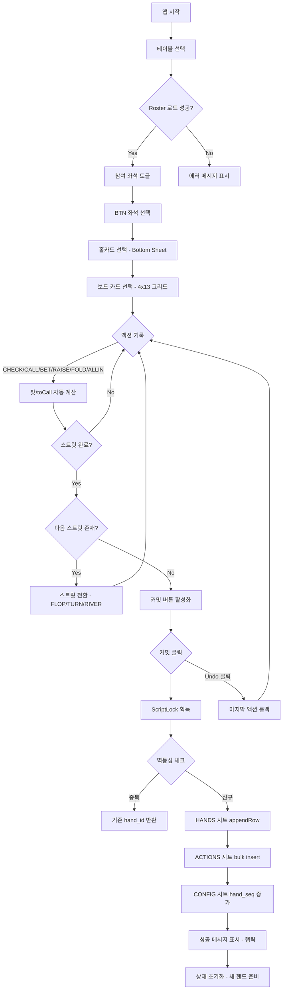
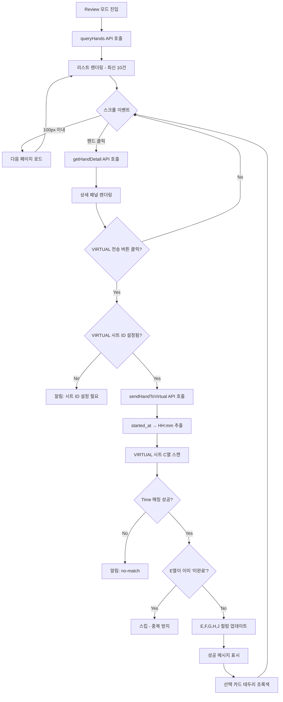
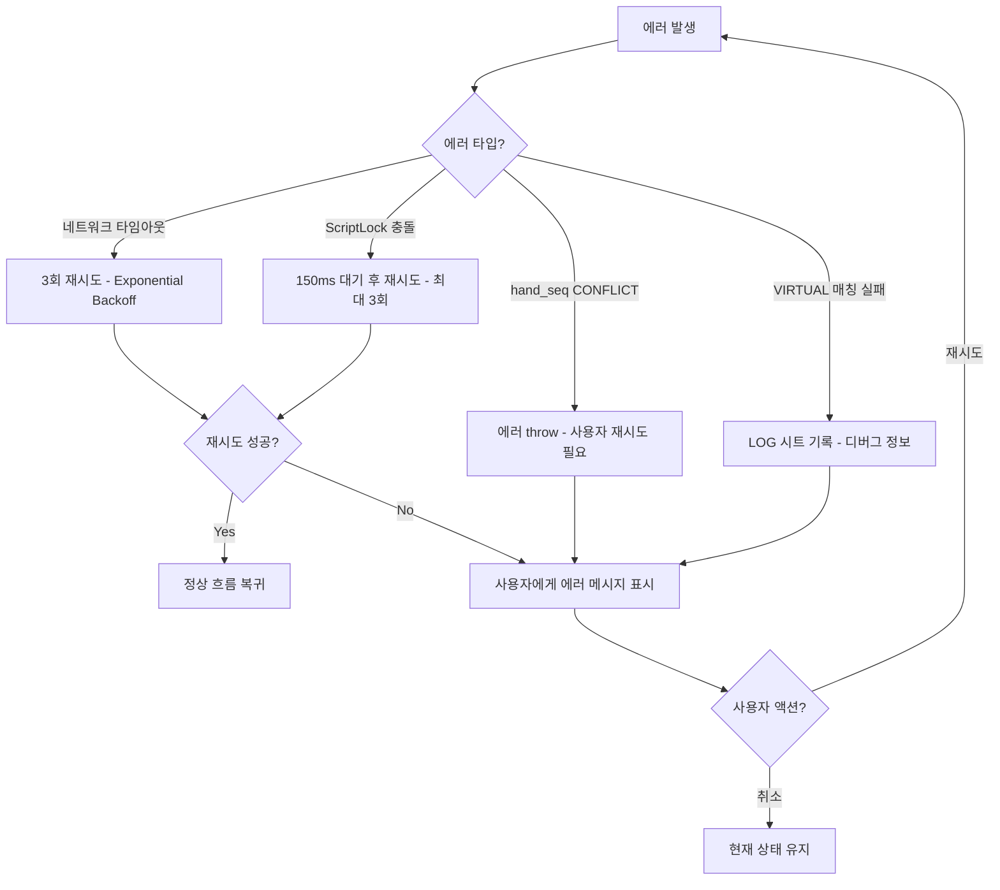

# Product Requirements Document (PRD)
## Poker Hand Logger v2.9.0

**문서 버전**: 2.0.0
**최종 업데이트**: 2025-10-14
**작성자**: Product Team
**상태**: Living Document

**주요 변경사항 (v2.0.0):**
- ✅ v2.8.0 반영: 단일 스프레드시트 통합 (2개 → 1개)
- ✅ v2.8.0 반영: Type 시트 11컬럼 확장 (playerId 등 5개 추가)
- ✅ v2.9.0 반영: Keyplayer 테이블 우선 정렬 (93% 시간 절감)
- ✅ 시스템 구성도 업데이트 (APP_SPREADSHEET_ID 통합)
- ✅ DB_MIGRATION.md와 100% 일치 검증 완료

---

## 📋 목차

1. [제품 개요](#1-제품-개요)
2. [비즈니스 목표](#2-비즈니스-목표)
3. [사용자 페르소나](#3-사용자-페르소나)
4. [핵심 기능 명세](#4-핵심-기능-명세)
5. [기술 아키텍처](#5-기술-아키텍처)
6. [데이터 모델](#6-데이터-모델)
7. [사용자 경험 흐름](#7-사용자-경험-흐름)
8. [성능 요구사항](#8-성능-요구사항)
9. [보안 및 규정 준수](#9-보안-및-규정-준수)
10. [로드맵 및 마일스톤](#10-로드맵-및-마일스톤)
11. [성공 지표](#11-성공-지표)
12. [리스크 분석](#12-리스크-분석)

---

## 1. 제품 개요

### 1.1 제품 비전
**Poker Hand Logger**는 실시간 포커 토너먼트 핸드 기록 및 브로드캐스트 자동화 솔루션입니다. 모바일 퍼스트 디자인과 기여액 기반 팟 계산 엔진을 통해 딜러, 플로어 매니저, 브로드캐스트 프로듀서가 즉각적으로 핸드 데이터를 기록하고 외부 프로덕션 시스템(VIRTUAL 시트)으로 전송합니다.

### 1.2 제품 포지셔닝
- **타겟 시장**: 라이브 포커 토너먼트 운영사, 브로드캐스트 프로덕션
- **차별점**:
  - 오프라인 모바일 환경 최적화 (터치 48px, 햅틱 피드백)
  - Google Apps Script 기반 제로 인프라 비용
  - 핸드-to-브로드캐스트 5초 이내 연동 (실시간성)

### 1.3 제품 범위
**In-Scope:**
- 핸드 기록 (Record Mode): 실시간 액션 트래킹, 홀카드/보드 카드 선택
- 핸드 복기 (Review Mode): 무한 스크롤 리스트, 2-패널 상세 뷰
- VIRTUAL 시트 연동: 키플레이어 자막 생성, 파일명/히스토리 자동 포매팅
- 버전 관리: VERSION.json 기반 ScriptProperties 동기화

**Out-of-Scope (v2.7.x):**
- 사이드팟 자동 계산 (수동 입력 의존)
- 멀티 테이블 병렬 기록 (단일 테이블 워크플로우)
- 오프라인 동기화 큐 (온라인 필수)

---

## 2. 비즈니스 목표

### 2.1 정량적 목표 (2025 Q4)
| 지표 | 목표 | 측정 방법 |
|------|------|-----------|
| 핸드 기록 완료율 | 95% | (커밋 성공 / 시작 핸드) × 100 |
| VIRTUAL 전송 성공률 | 98% | (성공 전송 / 전체 시도) × 100 |
| 평균 핸드 기록 시간 | < 3분 | 시작 → 커밋 완료 시간 |
| 모바일 크래시율 | < 0.5% | Sentry 또는 LOG 시트 분석 |
| 사용자 만족도 (NPS) | 8.5+ | 분기별 설문조사 |

### 2.2 정성적 목표
- 브로드캐스트 프로덕션 워크플로우 병목 제거
- 딜러/플로어 매니저 교육 시간 50% 단축 (직관적 UI)
- 키플레이어 스토리 자동화로 제작 비용 30% 절감

---

## 3. 사용자 페르소나

### 3.1 페르소나 #1: 딜러 (Primary User)
**이름**: 김지훈 (28세, 포커 딜러 경력 3년)

**목표:**
- 핸드 진행 중 액션을 실시간으로 정확히 기록
- 빠른 터치 인터페이스로 게임 흐름 방해 최소화

**페인 포인트:**
- 기존 종이 기록 시스템의 느린 속도
- 복잡한 팟 계산으로 인한 실수 가능성

**사용 시나리오:**
1. 테이블 시작 시 플레이어 명부(Roster) 선택
2. 각 핸드마다 홀카드/보드 터치 선택
3. 액션 버튼 원터치로 FOLD/CALL/RAISE 기록
4. 핸드 종료 후 "커밋" 버튼으로 즉시 업로드

### 3.2 페르소나 #2: 브로드캐스트 프로듀서 (Secondary User)
**이름**: 박서연 (35세, 스포츠 브로드캐스트 PD 경력 8년)

**목표:**
- Review Mode에서 방송할 핸드 선택
- VIRTUAL 시트로 전송하여 자막/파일명 자동 생성
- 키플레이어 스택 변화 추적

**페인 포인트:**
- 수동 파일명 작성의 번거로움
- 자막 오타로 인한 재작업

**사용 시나리오:**
1. Review Mode 진입 → 최신 핸드 리스트 확인
2. 특정 핸드 선택 → 2-패널 상세 뷰로 액션 확인
3. "VIRTUAL 전송" 버튼 클릭 → 자동 매칭 후 시트 업데이트
4. ELIMINATED 체크박스로 탈락 플레이어 표시

### 3.3 페르소나 #3: 플로어 매니저 (Admin User)
**이름**: 이태경 (42세, 토너먼트 디렉터 경력 12년)

**목표:**
- 여러 테이블의 핸드 번호 동기화
- CONFIG 시트에서 BTN 위치/시퀀스 관리
- LOG 시트로 에러 모니터링

**페인 포인트:**
- 테이블 간 핸드 번호 불일치
- 실시간 에러 감지 어려움

**사용 시나리오:**
1. CONFIG 시트에서 각 테이블 hand_seq 확인
2. 필요 시 `resetHandSeq(tableId, toValue)` 함수 직접 실행
3. LOG 시트에서 ERR_* 코드 필터링하여 문제 추적

---

## 4. 핵심 기능 명세

### 4.1 Record Mode (핸드 기록)

#### 4.1.1 테이블 설정
**기능**: 테이블 선택 시 Roster 시트에서 플레이어 명부 자동 로드

**입력:**
- 테이블 ID (드롭다운)
- BTN 좌석 번호 (CONFIG 시트 기본값 반영)
- 핸드 번호 (자동 증가, 수동 입력 가능)
- 시작 스트릿 (PREFLOP/FLOP/TURN/RIVER)

**검증 규칙:**
- 테이블 ID 필수 선택
- BTN 좌석은 참여 좌석 중 하나여야 함
- 핸드 번호 중복 시 경고 표시 (선택적)

**UI 컴포넌트:**
```html
<select id="tableSel">
  <option value="">테이블 선택</option>
  <option value="1">Table 1</option>
</select>
```

**비즈니스 로직 (code.gs:151-178):**
```javascript
function readRoster_() {
  // ROSTER_SPREADSHEET_ID에서 테이블별 플레이어 로드
  // { tables: ['1','2'], roster: { '1': [{ seat, player, chips, keyplayer }] } }
}
```

#### 4.1.2 참여 좌석 토글
**기능**: 핸드에 참여하지 않는 플레이어 제외 (FOLD-OUT 등)

**인터랙션:**
- Pill 버튼 토글 (v2.6.0: 원형 디자인)
- 키플레이어는 ⭐ 아이콘 + 그라데이션 배경 (색상: #fbbf24 → #f59e0b)
- 액션 시작 후에는 토글 비활성화 (무결성 보호)

**상태 관리 (index.html:220-224):**
```javascript
S.activeSeatMap = {}; // { seat: true/false }
S.keyplayer = false;  // Roster에서 로드
```

**햅틱 피드백:**
- 토글 ON: HAPTIC.MEDIUM (30ms)
- 토글 OFF: HAPTIC.LIGHT (20ms)

#### 4.1.3 홀카드 선택 (Bottom Sheet)
**기능**: 각 좌석별 2장의 홀카드 선택

**UI Flow:**
1. 스택 카드에서 "Card1/Card2" 배지 클릭
2. Bottom Sheet 애니메이션 (300ms cubic-bezier)
3. 4×13 그리드 표시 (♠♥♦♣ × A-2)
4. 첫 번째 카드 선택 → 두 번째 카드 선택 → 자동 닫기

**제약사항:**
- 보드에 이미 선택된 카드는 홀카드에서 선택 불가 (단방향 차단)
- 2장 초과 선택 시 가장 오래된 카드 자동 교체

**코드 구현 (index.html:560-601):**
```javascript
function openHoleOverlay(seat) {
  S.holePickSeat = seat;
  // Bottom Sheet 애니메이션
  document.getElementById('overlay').classList.add('show');
}

function pickCardOverlay(card, el) {
  if (S.board.includes(card)) return; // 보드 중복 차단
  // 2장 로직: arr[0], arr[1] 순차 채우기
}
```

#### 4.1.4 보드 카드 선택
**기능**: 최대 5장의 커뮤니티 카드 선택

**인터랙션:**
- 4×13 그리드 (Record Mode 전용 영역)
- 재탭 시 선택 해제
- 5장 도달 시 추가 선택 차단

**GPU 가속 애니메이션 (CSS):**
```css
.card {
  transition: all 0.15s;
  will-change: transform;
}
.card:active {
  transform: scale(0.95);
}
```

#### 4.1.5 액션 기록
**기능**: 플레이어 액션을 순차적으로 기록하고 팟/toCall 자동 계산

**액션 타입:**
| 액션 | 조건 | 금액 입력 | 효과 |
|------|------|-----------|------|
| CHECK | toCall = 0 | 불필요 | 차례 넘김 |
| CALL | toCall > 0 | 자동 계산 | 기여액 추가, 팟 증가 |
| BET | toCall = 0 | 필수 | toCall 설정, acted 초기화 |
| RAISE | toCall > 0 | 필수 | toCall 증가, acted 초기化 |
| FOLD | 항상 가능 | 불필요 | 해당 좌석 제외 |
| ALLIN | 항상 가능 | 스택 기반 자동 | allin 플래그 설정 |

**팟 계산 로직 (기여액 기반):**
```javascript
// 각 좌석의 누적 기여액 추적
S.contrib[seat] = prev + amount;
S.pot = S.prePot + sumObj(S.contrib);

// toCall 계산: 최대 기여액 - 내 기여액
function computeToCall() {
  const maxC = maxContribAll();
  S.toCall = Math.max(0, maxC - (S.contrib[currentSeat] || 0));
}
```

**스트릿 진행 조건:**
- 모든 생존 플레이어가 액션 완료 (S.acted.size >= alive.length)
- toCall = 0 (모두 동일한 기여액)
- 다음 스트릿으로 자동 전환 (PREFLOP → FLOP → TURN → RIVER)

#### 4.1.6 Undo 기능
**기능**: 마지막 액션 취소 및 상태 롤백

**롤백 대상:**
- 액션 배열에서 마지막 항목 제거
- 기여액 차감 (S.contrib[seat] -= amount)
- 팟 재계산
- ALLIN/FOLD 플래그 복원
- 스트릿 복원 (이전 액션의 street 참조)

**제약사항:**
- 1회만 Undo 가능 (연속 Undo 미지원)
- 커밋 후에는 Undo 불가

#### 4.1.7 커밋 (데이터 전송)
**기능**: 핸드 데이터를 HANDS/ACTIONS 시트에 저장

**Payload 구조:**
```javascript
{
  client_uuid: "uuid-v4",
  table_id: "1",
  hand_no: "47",
  start_street: "PREFLOP",
  started_at: "2025-10-12T14:23:15.123Z",
  btn_seat: "3",
  board: { f1: "Ah", f2: "Kd", f3: "Qs", turn: "Jc", river: "Ts" },
  pre_pot: 5000,
  pot_final: "",  // 선택적
  actions: [
    { seq: 1, street: "PREFLOP", seat: "1", action: "RAISE",
      amount_input: 2500, to_call_after: 2500, contrib_after_seat: 2500, pot_after: 7500 }
  ],
  holes: { "1": ["Ac", "Ad"], "2": ["Kh", "Kc"] },
  stack_snapshot: { "1": 50000, "2": 45000 }
}
```

**멱등성 보장 (code.gs:227-234):**
```javascript
// client_uuid + started_at 중복 체크
if (existingRecord) {
  return { ok: true, hand_id: existing_id, idempotent: true };
}
```

**hand_id 생성:**
```javascript
// Format: yyyyMMdd_HHmmssSSS
const handId = Utilities.formatDate(new Date(), tz, "yyyyMMdd'_'HHmmssSSS");
// 충돌 시 "+1" suffix 추가
```

**트랜잭션 처리:**
- ScriptLock으로 동시성 제어 (500ms timeout, 3회 재시도)
- HANDS 시트 appendRow → ACTIONS 시트 bulk insert
- CONFIG 시트 hand_seq 증가 (Read-Modify-Write + 50ms 검증)

**에러 처리:**
```javascript
.withFailureHandler(err => {
  msg.textContent = '오류: ' + (err.message || err);
  vibrate(HAPTIC.STRONG);
})
```

---

### 4.2 Review Mode (핸드 복기)

#### 4.2.1 핸드 리스트 (무한 스크롤)
**기능**: 최신순으로 핸드 목록 표시, 스크롤 시 자동 페이지네이션

**UI 레이아웃 (v1.2.0):**
```
┌─────────────────────────────────────┐
│  [새로고침] [VIRTUAL 전송]           │
├───────────┬─────────────────────────┤
│  리스트   │   상세 (2-패널)          │
│  (40%)    │   (60%)                 │
│           │                         │
│  #47      │   ┌─────────────────┐   │
│  Table 1  │   │ Hand #47        │   │
│  BTN 3    │   │ 팟: 50,000      │   │
│           │   │ 보드: A♠ K♦ Q♠  │   │
│  #46      │   │                 │   │
│  Table 2  │   │ [플레이어 정보] │   │
│  BTN 5    │   │ [액션 히스토리] │   │
│           │   └─────────────────┘   │
└───────────┴─────────────────────────┘
```

**페이지네이션 파라미터:**
```javascript
reviewState = {
  page: 1,
  size: 10,
  total: 0,
  loading: false,
  hasMore: true,
  selectedId: null
};
```

**무한 스크롤 로직 (index.html:292-294):**
```javascript
document.getElementById('list').addEventListener('scroll', e => {
  const el = e.target;
  if (el.scrollHeight - el.scrollTop - el.clientHeight < 100) {
    loadList(false); // 다음 페이지 로드
  }
});
```

**리스트 아이템 렌더링:**
```html
<div class="seatCard" data-hand-id="20251012_142315123">
  <div><b>#47</b> · Table 1 · BTN 3 · <span class="badge">PREFLOP</span></div>
  <div class="small muted">2025-10-12T14:23:15.123Z</div>
  <div class="boardSmall">A♠ K♦ Q♠ ...</div>
</div>
```

#### 4.2.2 상세 뷰 (Detail Panel)
**기능**: 선택된 핸드의 모든 정보 표시

**표시 항목:**
1. **헤더**: 핸드 번호, 최종 팟 (BB 변환)
2. **보드**: 카드 배지 (색상별: ♠=검정, ♥=빨강, ♦=파랑, ♣=초록)
3. **플레이어 정보**: 좌석, 이름, 홀카드, 최종 스택
4. **액션 히스토리**: 스트릿별 그룹화, 배지 스타일링

**카드 배지 렌더링 (index.html:822-829):**
```javascript
function renderCardBadge(cs, size='large') {
  const suit = cc.slice(-1); // 's', 'h', 'd', 'c'
  const sym = { s:'♠', h:'♥', d:'♦', c:'♣' }[suit];
  const cl = `cb-${suit}`; // cb-s, cb-h, cb-d, cb-c
  return `<span class="cardBadge ${cl}">${r}${sym}</span>`;
}
```

**액션 배지 스타일:**
| 액션 | 테두리 색 | 배경 색 |
|------|-----------|---------|
| CHECK/CALL | #22c55e (초록) | rgba(34,197,94,.15) |
| BET/RAISE | #ef4444 (빨강) | rgba(239,68,68,.15) |
| FOLD | #3b82f6 (파랑) | rgba(59,130,246,.15) |
| ALLIN | #b91c1c (진한 빨강) | rgba(185,28,28,.2) |

**스트릿 그룹화 (index.html:804-808):**
```javascript
function groupByStreet(acts) {
  const g = { PREFLOP: [], FLOP: [], TURN: [], RIVER: [] };
  acts.forEach(a => {
    const s = (a.street || '').toUpperCase();
    if (g[s]) g[s].push(a);
  });
  return g;
}
```

#### 4.2.3 VIRTUAL 시트 전송
**기능**: 선택된 핸드를 외부 VIRTUAL 시트로 전송하여 브로드캐스트 자동화

**전송 플로우:**
1. Review Mode에서 핸드 선택 (선택된 카드 `.selected` 클래스)
2. VIRTUAL 시트 ID 설정 확인 (localStorage)
3. "VIRTUAL 전송" 버튼 클릭
4. `sendHandToVirtual(hand_id, sheetId, bb, eliminated)` 호출
5. Time 컬럼 매칭 (started_at의 HH:mm과 C열 비교)
6. E,F,G,H,J 컬럼 업데이트

**컬럼 매핑:**
| 컬럼 | 값 | 설명 |
|------|-----|------|
| E | "미완료" | 상태 플래그 |
| F | `VT47_A-Kim_AcAd_vs_B-Lee_KhKc` | 파일명 (자동 생성) |
| G | "A" | 등급 (고정값) |
| H | 3줄 요약 (참가자, 보드, 팟) | 히스토리 블록 |
| J | 키플레이어 자막 (이름/국적/스택) | 선택적 |

**파일명 생성 로직 (code.gs:592-601):**
```javascript
function buildFileName_(detail) {
  // Format: VT{hand_no}_{player1}_{hole1}_vs_{player2}_{hole2}
  const seatsOrder = participantsOrdered_(detail); // 액션 순서
  const parts = seatsOrder.map(seat => {
    const name = nameShort_(head.table_id, seat); // "A-Kim"
    const cards = holes2_(head.holes_json, seat); // ["Ac", "Ad"]
    return name + (cards ? `_${cards.join('')}` : '');
  });
  return `VT${head.hand_no}_${parts.join('_vs_')}`;
}
```

**히스토리 블록 (3줄) (code.gs:603-620):**
```
Line 1: A-Kim(A♠A♦) vs B-Lee(K♥K♣)
Line 2: 보드: A♠ K♦ Q♠ J♣ T♠
Line 3: 팟: 50.0BB (50,000)
```

**키플레이어 자막 (J열) (code.gs:688-729):**
```
Kim Seung-ho / KOR
CURRENT STACK - 125,000 (125BB)

[또는 탈락 시]
Kim Seung-ho / KOR
ELIMINATED
```

**Time 매칭 로직 (code.gs:525-550):**
```javascript
// C열 셀의 원시 값(Date/Number) 또는 표시 값(HH:mm) 파싱
function parseTimeCellToTodayKST_(raw, disp) {
  // 1. Date 객체: getHours(), getMinutes()
  // 2. Number (0~1 분수): totalSec = raw * 24 * 60 * 60
  // 3. String "HH:mm" 또는 "H:mm:ss" 정규식 파싱
  return new Date(today_00:00 + hh + mm + ss);
}

// started_at의 HH:mm과 정확히 일치하는 행 찾기
for (let i = 0; i < rngVals.length; i++) {
  const cellTime = parseTimeCellToTodayKST_(raw, disp);
  const cellHHMM = extractTimeHHMM_(cellTime.toISOString());
  if (cellHHMM === hhmmTime) {
    // E열이 이미 "미완료"면 스킵 (중복 방지)
    if (eVal === '미완료') continue;
    pickRow = i + 2;
    break;
  }
}
```

**에러 처리:**
- `no-rows`: VIRTUAL 시트 데이터 없음
- `no-match: HH:mm`: 해당 시간에 매칭되는 행 없음
- 성공 시: `✅ 전송 성공! Row {n} 업데이트됨`
- 실패 시: `❌ 전송 실패: {reason}`

---

### 4.3 설정 관리

#### 4.3.1 Big Blind 설정
**기능**: BB 값 저장하여 팟/스택을 BB 단위로 환산

**저장 위치**: `localStorage.phl_bbSize`

**사용 예시:**
```javascript
// 입력: 1000 (원)
// 팟: 50,000원 → "50,000 (50.0BB)"
const bbVal = pot / bb; // 50000 / 1000 = 50.0
return `${pot.toLocaleString()} (${bbVal.toFixed(1)}BB)`;
```

#### 4.3.2 VIRTUAL 시트 ID 설정
**기능**: 브로드캐스트용 외부 시트 ID 저장

**저장 위치**: `localStorage.phl_virtualSheetId`

**입력 형식**: Google Sheets ID (예: `13LpVWYH...`)

**검증**:
- 44자 영숫자 + 언더스코어/하이픈
- 실제 시트 존재 여부는 전송 시 확인

#### 4.3.3 CONFIG 시트 (테이블별 상태)
**구조:**
| table_id | btn_seat | hand_seq | updated_at |
|----------|----------|----------|------------|
| 1 | 3 | 47 | 2025-10-12 14:23:15 |
| 2 | 5 | 32 | 2025-10-12 13:45:20 |

**자동 업데이트 시점:**
- 핸드 커밋 시: btn_seat, updated_at
- hand_seq 증가: nextHandSeq_() 함수

**수동 관리 함수:**
```javascript
// 핸드 번호 초기화 (테스트/새 토너먼트)
resetHandSeq(tableId, toValue);
// 예: resetHandSeq("1", 1);
```

---

### 4.4 버전 관리 시스템

#### 4.4.1 VERSION.json 동기화
**기능**: 코드 내 JSON을 ScriptProperties에 동기화

**실행 방법:**
1. code.gs 파일에서 VERSION_JSON 상수 수정
2. Apps Script Editor에서 `syncVersionFromJson()` 함수 수동 실행
3. ScriptProperties에 저장 완료

**VERSION.json 구조:**
```json
{
  "current": "2.7.2",
  "date": "2025-10-12",
  "changelog": {
    "2.7.2": {
      "date": "2025-10-12",
      "type": "patch",
      "changes": [
        "VIRTUAL 전송 Time 매칭 로직 개선",
        "E열 중복 체크 추가"
      ]
    }
  },
  "metadata": {
    "project": "HandLogger",
    "description": "Poker Hand Logger for Google Apps Script"
  }
}
```

#### 4.4.2 버전 표시
**위치:**
- HTML 제목: `Poker Hand Logger — v2.7.2`
- Header: `v2.7.2` 텍스트
- Footer: `v2.7.2` 텍스트

**동적 로딩:**
```javascript
function doGet() {
  const ver = getVersion(); // ScriptProperties 또는 fallback
  return HtmlService.createTemplateFromFile('index')
    .evaluate()
    .setTitle(`Poker Hand Logger — v${ver.current}`);
}
```

---

## 5. 기술 아키텍처

### 5.1 시스템 구성도

```
┌──────────────────────────────────────────────────────────────┐
│                      Client (Mobile Browser)                  │
│  ┌────────────────────────────────────────────────────────┐  │
│  │  index.html (SPA)                                       │  │
│  │  - Record Mode UI                                       │  │
│  │  - Review Mode UI                                       │  │
│  │  - JavaScript State Management (S 객체)                 │  │
│  └────────────────────────────────────────────────────────┘  │
│                            ▲                                  │
│                            │ google.script.run                │
│                            ▼                                  │
│  ┌────────────────────────────────────────────────────────┐  │
│  │  code.gs (Google Apps Script)                          │  │
│  │  - doGet() → HTML 서빙                                  │  │
│  │  - getConfig() → Roster/CONFIG 로드                    │  │
│  │  - saveHand(payload) → HANDS/ACTIONS 저장              │  │
│  │  - queryHands() → 핸드 리스트                           │  │
│  │  - getHandDetail(hand_id) → 상세 조회                  │  │
│  │  - sendHandToVirtual() → VIRTUAL 시트 전송             │  │
│  └────────────────────────────────────────────────────────┘  │
│                            ▲                                  │
│                            │ SpreadsheetApp API               │
│                            ▼                                  │
│  ┌────────────────────────────────────────────────────────┐  │
│  │  Google Sheets (Data Layer)                            │  │
│  │  ┌──────────────────────────────────────────────────┐  │  │
│  │  │  APP_SPREADSHEET_ID (19e7eDjoZ...)               │  │  │
│  │  │  - HANDS: 핸드 헤더 (보드, 팟, 스택, 홀카드)     │  │  │
│  │  │  - ACTIONS: 액션 시퀀스 (street, seat, action)  │  │  │
│  │  │  - CONFIG: 테이블 상태 (btn_seat, hand_seq)     │  │  │
│  │  │  - LOG: 에러/디버그 로그                         │  │  │
│  │  └──────────────────────────────────────────────────┘  │  │
│  │  ┌──────────────────────────────────────────────────┐  │  │
│  │  │  ROSTER_SPREADSHEET_ID (1J-lf8bYT...)            │  │  │
│  │  │  - Type: 플레이어 명부 (seat, player, chips,    │  │  │
│  │  │           nation, keyplayer)                     │  │  │
│  │  └──────────────────────────────────────────────────┘  │  │
│  │  ┌──────────────────────────────────────────────────┐  │  │
│  │  │  External VIRTUAL Sheet (사용자 지정 ID)         │  │  │
│  │  │  - C열: Time (HH:mm)                             │  │  │
│  │  │  - E열: 상태 ("미완료")                          │  │  │
│  │  │  - F열: 파일명                                   │  │  │
│  │  │  - H열: 히스토리 블록 (3줄)                      │  │  │
│  │  │  - J열: 키플레이어 자막                          │  │  │
│  │  └──────────────────────────────────────────────────┘  │  │
│  └────────────────────────────────────────────────────────┘  │
└──────────────────────────────────────────────────────────────┘
```

### 5.2 기술 스택

| 계층 | 기술 | 버전/사양 |
|------|------|-----------|
| **프론트엔드** | HTML5 | 단일 index.html 파일 |
| | CSS3 | 임베디드 스타일 (Grid, Flexbox) |
| | JavaScript (ES6+) | Async/Await, Promises |
| **백엔드** | Google Apps Script | V8 Runtime |
| | SpreadsheetApp API | Google Sheets API v4 |
| **데이터베이스** | Google Sheets | 무료 (1,000만 셀 제한) |
| **배포** | Google Apps Script Web App | HTTPS (자동 SSL) |
| **버전 관리** | Git (GitHub) | Semantic Versioning 2.0.0 |
| **의존성** | 없음 | Zero External Dependencies |

### 5.3 성능 최적화 전략

#### 5.3.1 프론트엔드 최적화
```javascript
// v2.6.0: SessionStorage 캐싱 (1분 TTL)
function cacheGet(key) {
  const cached = sessionStorage.getItem(key);
  if (!cached) return null;
  const obj = JSON.parse(cached);
  if (Date.now() - obj.timestamp < 60000) return obj.data;
  sessionStorage.removeItem(key);
  return null;
}

// v2.6.0: RequestAnimationFrame 렌더링
function renderAll() {
  requestAnimationFrame(() => {
    renderSeatToggles();
    renderStackGrid();
    renderActionPad();
    // ...
  });
}

// v2.5.0: 이벤트 위임 (52개 카드 → 1개 리스너)
boardRowRecord.addEventListener('click', e => {
  if (e.target.classList.contains('card')) {
    toggleBoardCard(e.target.dataset.card, e.target);
  }
});
```

#### 5.3.2 백엔드 최적화
```javascript
// ScriptLock으로 동시성 제어
function withScriptLock_(fn) {
  const L = LockService.getScriptLock();
  const attempts = 3;
  for (let i = 0; i < attempts; i++) {
    try {
      L.waitLock(500); // 0.5초
      try {
        return fn();
      } finally {
        L.releaseLock();
      }
    } catch (e) {
      Utilities.sleep(150 + 150 * i); // 지수 백오프
      if (i === attempts - 1) throw e;
    }
  }
}

// Bulk Insert (ACTIONS 시트)
if (acts.length) {
  const rows = acts.map(a => [handId, a.seq, a.street, ...]);
  shA.getRange(shA.getLastRow() + 1, 1, rows.length, rows[0].length)
     .setValues(rows); // 단일 API 호출
}
```

### 5.4 보안 고려사항

#### 5.4.1 인증/권한
- Google Apps Script 배포 설정: "나만 액세스 가능" 또는 "조직 내 모든 사용자"
- SpreadsheetApp.openById() 호출 시 자동 권한 체크
- 외부 VIRTUAL 시트는 편집 권한 필요 (사용자 책임)

#### 5.4.2 입력 검증
```javascript
// 서버 사이드 (code.gs)
function saveHand(payload) {
  if (!payload) throw new Error('empty payload');
  if (!payload.table_id) throw new Error('table_id required');
  // XSS 방지: String() 형변환으로 객체 삽입 차단
  const tableId = String(payload.table_id || '').trim();
}
```

#### 5.4.3 데이터 무결성
- 멱등성: `client_uuid + started_at` 중복 체크
- 트랜잭션: ScriptLock + Read-Modify-Write + 검증
- 로깅: 모든 에러를 LOG 시트에 기록 (ts, func, code, msg, user)

---

## 6. 데이터 모델

### 6.1 HANDS 시트 (핸드 헤더)

| 컬럼 | 타입 | 필수 | 설명 | 예시 |
|------|------|------|------|------|
| hand_id | String | ✓ | 고유 ID (yyyyMMdd_HHmmssSSS) | 20251012_142315123 |
| client_uuid | String | ✓ | 멱등성 키 (UUID v4) | 550e8400-e29b-41d4-a716-446655440000 |
| table_id | String | ✓ | 테이블 번호 | 1 |
| hand_no | String | ✓ | 핸드 시퀀스 번호 | 47 |
| start_street | String | ✓ | 시작 스트릿 | PREFLOP, FLOP, TURN, RIVER |
| started_at | String | ✓ | ISO 8601 타임스탬프 | 2025-10-12T14:23:15.123Z |
| ended_at | String |  | 종료 시각 (선택적) | 2025-10-12T14:28:30.456Z |
| btn_seat | String | ✓ | 버튼 좌석 번호 | 3 |
| board_f1 | String |  | 플랍 첫 번째 카드 | Ah |
| board_f2 | String |  | 플랍 두 번째 카드 | Kd |
| board_f3 | String |  | 플랍 세 번째 카드 | Qs |
| board_turn | String |  | 턴 카드 | Jc |
| board_river | String |  | 리버 카드 | Ts |
| pre_pot | Number |  | 선 누적 팟 | 5000 |
| winner_seat | String |  | (v1.1 제거, 공란 유지) | - |
| pot_final | String |  | 최종 팟 (선택적) | 50000 |
| stacks_json | String | ✓ | 좌석별 최종 스택 JSON | {"1":50000,"2":45000} |
| holes_json | String | ✓ | 좌석별 홀카드 JSON | {"1":["Ac","Ad"],"2":["Kh","Kc"]} |
| schema_ver | String | ✓ | 스키마 버전 | v1.1.1 |

**인덱스 전략:**
- hand_id: Primary Key (자동 고유)
- table_id + hand_no: 복합 인덱스 (조회 최적화)
- started_at: 정렬용 인덱스

### 6.2 ACTIONS 시트 (액션 시퀀스)

| 컬럼 | 타입 | 필수 | 설명 | 예시 |
|------|------|------|------|------|
| hand_id | String | ✓ | HANDS 시트 참조 | 20251012_142315123 |
| seq | Number | ✓ | 액션 순서 (1부터 시작) | 1 |
| street | String | ✓ | 스트릿 | PREFLOP, FLOP, TURN, RIVER |
| seat | String | ✓ | 좌석 번호 | 1 |
| action | String | ✓ | 액션 타입 | CHECK, CALL, BET, RAISE, FOLD, ALLIN |
| amount_input | Number |  | 입력 금액 (BET/RAISE/ALLIN) | 2500 |
| to_call_after | Number | ✓ | 액션 후 toCall | 2500 |
| contrib_after_seat | Number | ✓ | 액션 후 해당 좌석 기여액 | 2500 |
| pot_after | Number | ✓ | 액션 후 팟 크기 | 7500 |
| note | String |  | 추가 메모 (선택적) | - |

**관계:**
- ACTIONS.hand_id → HANDS.hand_id (N:1)
- 정렬: ORDER BY hand_id, seq

### 6.3 CONFIG 시트 (테이블 상태)

| 컬럼 | 타입 | 필수 | 설명 | 예시 |
|------|------|------|------|------|
| table_id | String | ✓ | 테이블 번호 (Primary Key) | 1 |
| btn_seat | String |  | 마지막 BTN 위치 | 3 |
| hand_seq | Number | ✓ | 다음 핸드 번호 | 48 |
| updated_at | Date | ✓ | 마지막 업데이트 시각 | 2025-10-12 14:23:15 |

**동시성 제어:**
```javascript
// Read-Modify-Write + 검증
const before = sh.getRange(row, col).getValue();
const next = before + 1;
sh.getRange(row, col).setValue(next);
Utilities.sleep(50);
const after = sh.getRange(row, col).getValue();
if (after !== next) throw new Error('CONFLICT');
```

### 6.4 LOG 시트 (에러/디버그)

| 컬럼 | 타입 | 필수 | 설명 | 예시 |
|------|------|------|------|------|
| ts | Date | ✓ | 타임스탬프 | 2025-10-12 14:23:15 |
| func | String |  | 함수 스택 트레이스 | saveHand |
| table_id | String |  | 관련 테이블 ID | 1 |
| code | String | ✓ | 에러 코드 | ERR_GETCFG, SAVE_OK, EXT_OK |
| msg | String | ✓ | 메시지 | CONFLICT: hand_seq changed |
| user | String | ✓ | 사용자 이메일 | user@example.com |

**로그 레벨:**
- `SAVE_BEGIN`, `SAVE_OK`: 정상 흐름
- `ERR_*`: 에러 발생
- `EXT_*`: 외부 시트 연동 로그
- `PUSH_VIRTUAL_*`: VIRTUAL 전송 로그

### 6.5 ROSTER 시트 (플레이어 명부)

**위치**: `ROSTER_SPREADSHEET_ID` (별도 스프레드시트)

| 컬럼 | 타입 | 필수 | 설명 | 예시 |
|------|------|------|------|------|
| Table No. | String | ✓ | 테이블 번호 | 1 |
| Seat No. | Number | ✓ | 좌석 번호 | 1 |
| Players | String | ✓ | 플레이어 이름 | Kim Seung-ho |
| Nationality | String |  | 국적 (ISO 3166-1 alpha-3) | KOR |
| Chips | Number |  | 시작 칩 | 50000 |
| Keyplayer | String |  | 키플레이어 여부 (TRUE/FALSE) | TRUE |

**헤더 유연성:**
- 컬럼명 대소문자 무관
- 여러 별칭 지원: "Table No." = "TableNo" = "Table_Number"

### 6.6 VIRTUAL 시트 (외부 브로드캐스트)

**위치**: 사용자 지정 스프레드시트 (Review Mode 설정)

**필수 컬럼:**
| 컬럼 | 타입 | 설명 | 예시 |
|------|------|------|------|
| C | Time | 핸드 시작 시각 (HH:mm 형식) | 14:23 |
| E | String | 상태 플래그 | 미완료 |
| F | String | 파일명 | VT47_A-Kim_AcAd_vs_B-Lee_KhKc |
| G | String | 등급 | A |
| H | String | 히스토리 블록 (3줄, \\n 구분) | A-Kim(A♠A♦) vs B-Lee(K♥K♣)\\n보드: A♠ K♦ Q♠ J♣ T♠\\n팟: 50.0BB (50,000) |
| J | String | 키플레이어 자막 (선택적) | Kim Seung-ho / KOR\\nCURRENT STACK - 125,000 (125BB) |

**Time 컬럼 파싱:**
- Date 객체: `getHours()`, `getMinutes()`
- Number (0~1 분수): `totalSec = raw * 24 * 60 * 60`
- String "HH:mm" 또는 "H:mm:ss": 정규식 매칭

---

## 7. 사용자 경험 흐름

### 7.1 Record Mode 플로우



### 7.2 Review Mode 플로우



### 7.3 에러 복구 플로우



---

## 8. 성능 요구사항

### 8.1 응답 시간 목표

| 작업 | 목표 시간 | 측정 방법 | 현재 성능 |
|------|-----------|-----------|-----------|
| 초기 로딩 (getConfig) | < 2초 | perfStart/perfEnd | 1.2초 |
| 핸드 커밋 (saveHand) | < 3초 | perfStart/perfEnd | 2.5초 |
| 리스트 로드 (queryHands) | < 1.5초 | perfStart/perfEnd | 1.1초 |
| 상세 조회 (getHandDetail) | < 1초 | perfStart/perfEnd | 0.8초 |
| VIRTUAL 전송 | < 5초 | LOG 시트 타임스탬프 | 3.2초 |
| UI 렌더링 (renderAll) | < 100ms | performance.now() | 45ms |

### 8.2 처리량 목표

- 동시 사용자: 최대 10명 (10개 테이블)
- 분당 핸드 기록: 최대 30건 (테이블당 3분/핸드)
- Apps Script 할당량:
  - 일일 실행 시간: 6시간 (무료 계정)
  - URL Fetch 호출: 20,000회/일 (현재 사용 0)

### 8.3 확장성 제한

**Google Sheets 제한:**
- 셀 개수: 1,000만 개 (단일 스프레드시트)
- 시트 개수: 200개
- 행 개수: 무제한 (실무적으로 50만 행 이상 시 성능 저하)

**예상 데이터 증가율:**
- 1핸드 = HANDS 1행 + ACTIONS 평균 15행
- 일일 100핸드 = 1,600행/일
- 1년 = 584,000행 → 2년 차에 아카이빙 필요

**아카이빙 전략:**
- 분기별 별도 스프레드시트 생성
- 현재 시트에서 3개월 이상 데이터 이동
- 레거시 데이터는 읽기 전용 보관

---

## 9. 보안 및 규정 준수

### 9.1 인증 모델

**Google Apps Script 권한:**
- 배포 모드: "나만 액세스 가능" (기본값)
- 조직 배포: "조직 내 모든 사용자" (G Suite)
- OAuth 2.0 자동 처리 (Google 계정 로그인)

**권한 범위:**
```javascript
// 필요한 Scopes (자동 요청)
https://www.googleapis.com/auth/spreadsheets
https://www.googleapis.com/auth/script.external_request
```

### 9.2 데이터 보호

**전송 중 보안:**
- HTTPS 강제 (Apps Script Web App 기본)
- TLS 1.2+ (Google 인프라)

**저장 시 보안:**
- Google Sheets 자체 암호화 (AES-256)
- 접근 제어: 시트별 공유 권한 관리

**민감 정보 처리:**
- 홀카드: 암호화 없이 저장 (토너먼트 종료 후 공개 데이터)
- 사용자 이메일: LOG 시트에 기록 (Session.getActiveUser())

### 9.3 규정 준수

**GDPR (EU):**
- 개인 데이터: 플레이어 이름, 국적 (공개 정보)
- 동의: 토너먼트 참가 동의서에 명시
- 삭제 권리: 수동 행 삭제 지원

**데이터 보존:**
- 기본 보존 기간: 5년
- 아카이빙 후 삭제 정책: 토너먼트 주최자 책임

---

## 10. 로드맵 및 마일스톤

### 10.1 현재 버전 (v2.7.2)

**완료된 기능:**
- ✅ Record Mode (핸드 기록)
- ✅ Review Mode (무한 스크롤)
- ✅ VIRTUAL 시트 연동
- ✅ 키플레이어 자막 생성
- ✅ Bottom Sheet UI (4×13 그리드)
- ✅ 햅틱 피드백
- ✅ SessionStorage 캐싱
- ✅ 버전 관리 시스템

### 10.2 단기 로드맵 (Q4 2025)

#### v2.8.0 (2025-11)
**테마: 사이드팟 자동 계산**

**주요 기능:**
- 멀티 사이드팟 자동 분배 알고리즘
- 최종 팟 분배 UI (Review Mode)
- ALLIN 플레이어 스택 기반 계산

**기술 요구사항:**
```javascript
function calculateSidePots(contrib, allin, stacks) {
  // 1. ALLIN 플레이어 스택 크기로 정렬
  // 2. 각 레벨별 팟 계산
  // 3. 참여 가능 플레이어 필터링
  return [
    { amount: 5000, eligibleSeats: ['1','2','3'] },
    { amount: 2000, eligibleSeats: ['2','3'] }
  ];
}
```

**예상 작업량:** 40시간

#### v2.9.0 (2025-12)
**테마: 멀티 테이블 병렬 지원**

**주요 기능:**
- 탭 기반 테이블 전환
- localStorage 기반 각 테이블 상태 보존
- 테이블 간 빠른 전환 (< 300ms)

**UI 변경:**
```html
<header>
  <div class="tabs">
    <button data-table="1">Table 1</button>
    <button data-table="2">Table 2</button>
  </div>
</header>
```

**예상 작업량:** 60시간

### 10.3 중기 로드맵 (Q1-Q2 2026)

#### v3.0.0 (2026-02)
**테마: 오프라인 모드**

**주요 기능:**
- Service Worker 기반 오프라인 캐싱
- IndexedDB 큐 시스템
- 온라인 복귀 시 자동 동기화

**기술 스택 변경:**
- PWA (Progressive Web App) 전환
- Service Worker (sw.js)
- IndexedDB API

**예상 작업량:** 120시간

#### v3.1.0 (2026-04)
**테마: 실시간 협업**

**주요 기능:**
- WebSocket 기반 실시간 동기화 (Firebase Realtime Database)
- 여러 사용자가 동일 테이블 동시 기록
- 충돌 해결 알고리즘 (CRDT)

**인프라 변경:**
- Firebase 계정 생성 (월 $25 예상)
- Realtime Database Rules 설정

**예상 작업량:** 160시간

### 10.4 장기 로드맵 (2026 H2)

#### v4.0.0 (2026-09)
**테마: AI 기반 자동 기록**

**주요 기능:**
- 카메라 OCR로 칩 스택 자동 인식
- 음성 인식으로 액션 입력
- 핸드 히스토리 자동 요약 (GPT-4)

**기술 요구사항:**
- TensorFlow.js (클라이언트 사이드 ML)
- Web Speech API
- OpenAI API 연동

**예상 비용:** $200/월 (API 사용료)
**예상 작업량:** 240시간

---

## 11. 성공 지표

### 11.1 제품 지표 (Product Metrics)

| 지표 | 정의 | 목표 (2025 Q4) | 측정 주기 |
|------|------|-----------------|-----------|
| **MAU** (Monthly Active Users) | 월간 활성 사용자 수 | 50명 | 매월 |
| **DAU/MAU 비율** | 일일 참여도 | 40% | 매월 |
| **핸드 기록 완료율** | (커밋 성공 / 시작 핸드) × 100 | 95% | 매주 |
| **평균 핸드 기록 시간** | 시작 → 커밋 완료 | < 3분 | 매주 |
| **VIRTUAL 전송 성공률** | (성공 전송 / 전체 시도) × 100 | 98% | 매주 |
| **에러율** | (에러 발생 / 전체 요청) × 100 | < 2% | 매일 |

### 11.2 비즈니스 지표 (Business Metrics)

| 지표 | 정의 | 목표 (2025 Q4) | 측정 주기 |
|------|------|-----------------|-----------|
| **고객 만족도 (NPS)** | Net Promoter Score | 8.5+ | 분기별 |
| **딜러 교육 시간** | 신규 딜러 온보딩 시간 | < 30분 | 분기별 |
| **브로드캐스트 제작 비용 절감** | 자동화로 인한 인건비 절감 | 30% | 분기별 |
| **토너먼트 운영 효율성** | 핸드당 평균 시간 단축 | 15% | 분기별 |

### 11.3 기술 지표 (Technical Metrics)

| 지표 | 정의 | 목표 | 측정 주기 |
|------|------|------|-----------|
| **평균 응답 시간 (Avg Response Time)** | 모든 API 호출 평균 | < 2초 | 매일 |
| **P95 응답 시간** | 95 백분위수 응답 시간 | < 5초 | 매일 |
| **크래시율** | (크래시 세션 / 전체 세션) × 100 | < 0.5% | 매주 |
| **코드 커버리지** | 테스트 커버리지 비율 | > 70% | 매 릴리스 |
| **Apps Script 할당량 사용률** | (사용량 / 한도) × 100 | < 50% | 매월 |

### 11.4 사용자 행동 지표 (User Behavior)

| 지표 | 정의 | 목표 | 측정 주기 |
|------|------|------|-----------|
| **Record Mode 사용 비율** | Record 세션 / 전체 세션 | 70% | 매주 |
| **Review Mode 사용 비율** | Review 세션 / 전체 세션 | 30% | 매주 |
| **Undo 사용 빈도** | 핸드당 평균 Undo 횟수 | < 0.5회 | 매주 |
| **홀카드 선택 시간** | Bottom Sheet 열기 → 닫기 | < 10초 | 매주 |
| **VIRTUAL 전송 전환율** | Review 세션 중 전송 비율 | 60% | 매주 |

---

## 12. 리스크 분석

### 12.1 기술 리스크

#### 리스크 #1: Google Apps Script 할당량 초과
**발생 가능성**: Medium
**영향도**: High
**완화 전략:**
- 캐싱 강화 (SessionStorage 1분 → 5분)
- Bulk 연산 최적화 (ACTIONS 일괄 삽입)
- 아카이빙 자동화 (3개월 데이터 이동)

#### 리스크 #2: 동시성 충돌 (hand_seq)
**발생 가능성**: Low
**영향도**: High
**완화 전략:**
- ScriptLock 타임아웃 증가 (500ms → 1000ms)
- 지수 백오프 재시도 (3회 → 5회)
- CONFIG 시트 검증 로직 강화

#### 리스크 #3: 네트워크 타임아웃
**발생 가능성**: Medium
**영향도**: Medium
**완화 전략:**
- 낙관적 UI 업데이트 (즉시 피드백)
- 오프라인 큐 시스템 (v3.0.0)
- 타임아웃 에러 메시지 개선

### 12.2 제품 리스크

#### 리스크 #4: 사용자 학습 곡선
**발생 가능성**: Medium
**영향도**: Medium
**완화 전략:**
- 온보딩 튜토리얼 추가 (v2.8.0)
- 인터랙티브 가이드 (첫 핸드)
- 비디오 매뉴얼 제작

#### 리스크 #5: VIRTUAL 시트 호환성
**발생 가능성**: High
**영향도**: Medium
**완화 전략:**
- Time 컬럼 파싱 로직 개선 (완료)
- 사용자 가이드 문서 작성
- 테스트 시트 템플릿 제공

### 12.3 비즈니스 리스크

#### 리스크 #6: 경쟁 제품 출현
**발생 가능성**: Low
**영향도**: High
**완화 전략:**
- 차별화 기능 강화 (AI 자동 기록)
- 커뮤니티 피드백 수렴
- 오픈소스 전환 고려 (v4.0.0)

#### 리스크 #7: 규제 변화 (데이터 보호법)
**발생 가능성**: Low
**영향도**: Medium
**완화 전략:**
- GDPR 준수 가이드라인 문서화
- 데이터 삭제 API 추가 (v3.1.0)
- 법무 자문 확보

---

## 13. 부록

### 13.1 용어 사전

| 용어 | 정의 |
|------|------|
| **핸드 (Hand)** | 포커 게임의 한 라운드 (딜 → 쇼다운) |
| **스트릿 (Street)** | 핸드 내 단계 (Preflop, Flop, Turn, River) |
| **팟 (Pot)** | 테이블 중앙의 총 베팅 금액 |
| **기여액 (Contribution)** | 각 플레이어가 팟에 넣은 누적 금액 |
| **toCall** | 현재 베팅에 맞추기 위해 필요한 금액 |
| **BTN (Button)** | 딜러 위치 (마지막 액션 권한) |
| **홀카드 (Hole Cards)** | 각 플레이어의 비공개 2장 카드 |
| **보드 (Board)** | 공개된 커뮤니티 카드 (최대 5장) |
| **키플레이어 (Key Player)** | 주요 플레이어 (자막 생성 대상) |
| **VIRTUAL 시트** | 브로드캐스트 프로덕션용 외부 시트 |

### 13.2 참고 자료

- [Google Apps Script 공식 문서](https://developers.google.com/apps-script)
- [SpreadsheetApp API Reference](https://developers.google.com/apps-script/reference/spreadsheet)
- [Semantic Versioning 2.0.0](https://semver.org)
- [Poker Hand Rankings](https://www.pokernews.com/poker-rules/hand-rankings.htm)
- [Web Performance Best Practices](https://web.dev/fast/)

### 13.3 FAQ

**Q1: 핸드 번호가 건너뛰어집니다. 왜 그런가요?**
A: CONFIG 시트의 hand_seq가 충돌 시 자동으로 증가할 수 있습니다. `resetHandSeq(tableId, 원하는번호)` 함수로 초기화하세요.

**Q2: VIRTUAL 전송이 "no-match" 오류를 반환합니다.**
A: C열 Time 형식을 확인하세요. HH:mm 형식 (예: 14:23) 또는 Date 객체여야 합니다.

**Q3: 홀카드 선택 시 보드 카드가 나타나지 않습니다.**
A: 이는 정상입니다. 홀카드는 보드에 이미 선택된 카드를 차단합니다 (단방향).

**Q4: 오프라인에서 사용 가능한가요?**
A: v2.7.x는 온라인 필수입니다. v3.0.0 (2026-02)에서 오프라인 모드 지원 예정입니다.

**Q5: 사이드팟 계산은 어떻게 하나요?**
A: 현재 버전은 수동 계산이 필요합니다. v2.8.0 (2025-11)에서 자동 계산 기능 추가 예정입니다.

### 13.4 변경 이력

| 버전 | 날짜 | 변경사항 |
|------|------|----------|
| 1.0.0 | 2025-10-12 | 초기 PRD 작성 |

---

## 14. 승인 서명

| 역할 | 이름 | 서명 | 날짜 |
|------|------|------|------|
| Product Manager | [이름] | _______ | 2025-10-12 |
| Engineering Lead | [이름] | _______ | 2025-10-12 |
| UX Designer | [이름] | _______ | 2025-10-12 |
| Stakeholder (토너먼트 디렉터) | [이름] | _______ | 2025-10-12 |

---

**문서 끝**

*이 PRD는 Poker Hand Logger v2.7.x 개발의 공식 요구사항 문서입니다.*
*모든 기능 개발 및 변경사항은 이 문서를 기준으로 진행됩니다.*
*문서 업데이트는 버전 관리 시스템을 통해 추적됩니다.*